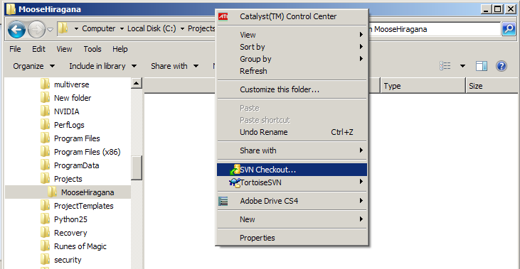
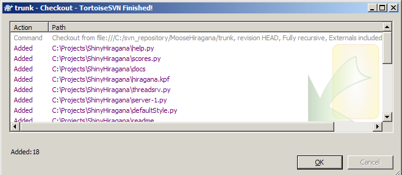
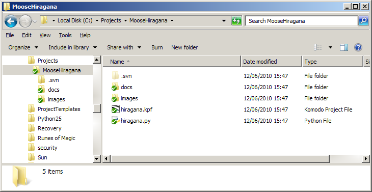
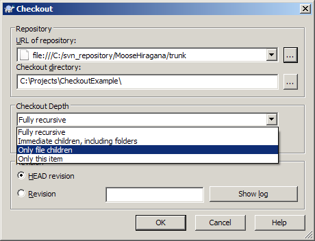
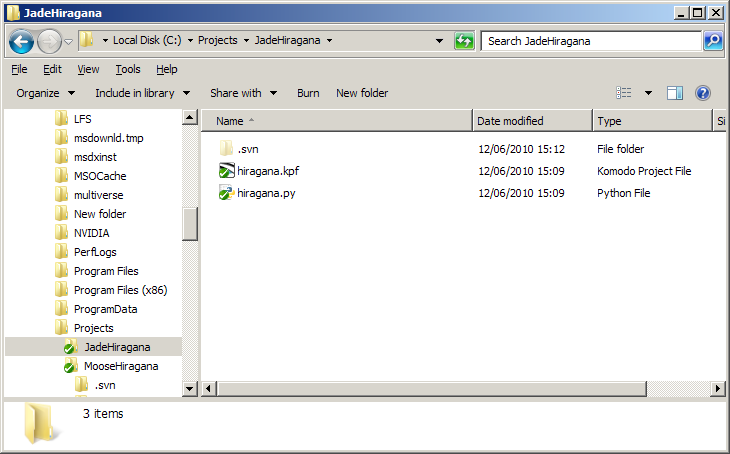

# SVN 检出

## 检出一个工作副本

1. 创建一个用于保存工作副本的目录。比如：`C:\Projects\MooseHiragana`。
2. 在此目录中右击调出上下文菜单，选择 **SVN Checkout...**。

   
3. 浏览您的项目版本库（或输入正确的网络地址）并点击 **OK**。

   
4. 会出现一个显示已检出的文件列表窗口。

   
5. 如果检出操作成功，您应该会在选择的文件夹中看到一个文件列表，每一个文件上都有一个绿色的钩子图表。

   

## 使用检出深度

1. 重复上述 1, 2 步骤。
2. 在 **Checkout** 窗口中同样先选择正确的版本库，然后在 **Checkout Depth** 下拉选择框中选择 **Only file children**。
   
   
3. 当检出过程完成之后，您应该会看到根文件夹中的所有文件都会出现在您的工作副本中，但是却没有检出任何其它文件夹。

   

**提示**：当项目尺寸变得相当大的时候，**检出深度** 特性会变得很有用。如果您的团队成员中有不少人只处理应用的某一部分时，这个特性也会很有用。举个例子，设计师仅会检出 `images` 文件夹，翻译也仅会检出包含本地化文件的文件夹。如果设计师后期需要扩展他的检出以包含更深层级的文件夹，他可以使用版本库浏览器来选择他需要的额外文件夹。

检出深度选项表：

| 检出深度选项                                                 | 作用                                                         |
| :----------------------------------------------------------- | :----------------------------------------------------------- |
| Fully recursive（全递归）                                    | 检出整个树，包括所有的直接子文件夹及下属子文件夹。           |
| Immediate children, including folders（直接子节点，包含文件夹） | 检出指定的目录，包括所有的文件和子文件夹，但是并不会填充子文件夹。 |
| Only file children（仅文件子节点）                           | 检出指定的目录，包括所有文件，但是不会检出任何子文件夹。     |
| Only this item（仅此项）                                     | 仅会检出选中的目录，不会使用文件或子文件夹填充它。           |
| Working copy（工作副本）                                     | 这个选项不会出现在 **checkout** 对话框中，但是它是其它具有深度设置对话框的默认值。这个选项告诉 TortoiseSVN 要遵循工作副本中的深度设置。 |
| Exclude（排除）                                              | 这个选项不会出现在 **checkout** 对话框中。它被用于当一个文件夹已经被填充之后减少工作副本深度的。 |

